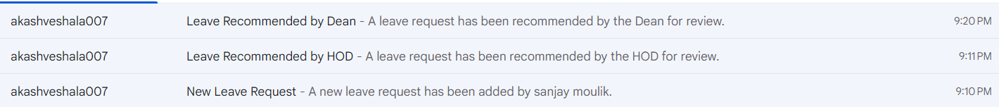
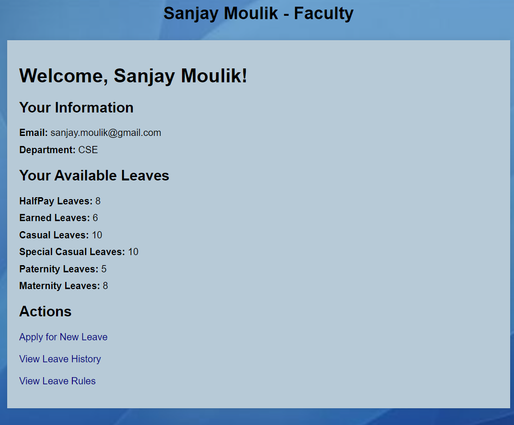
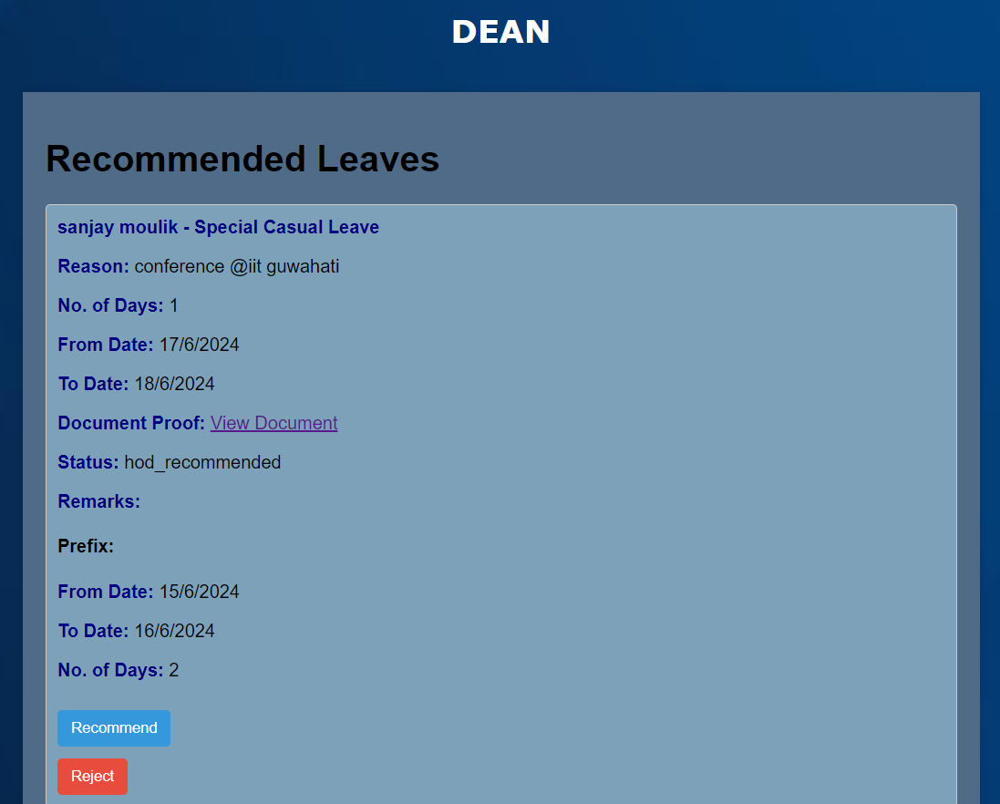
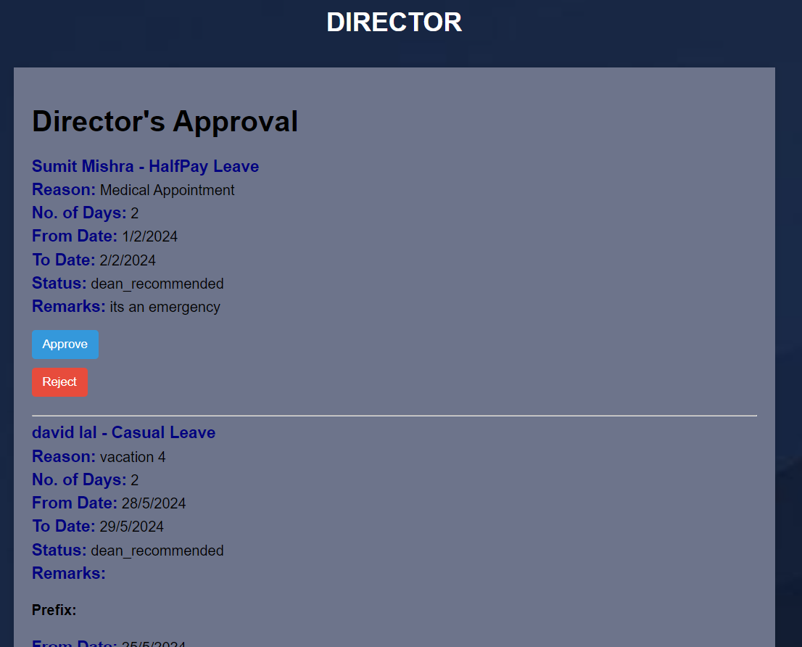
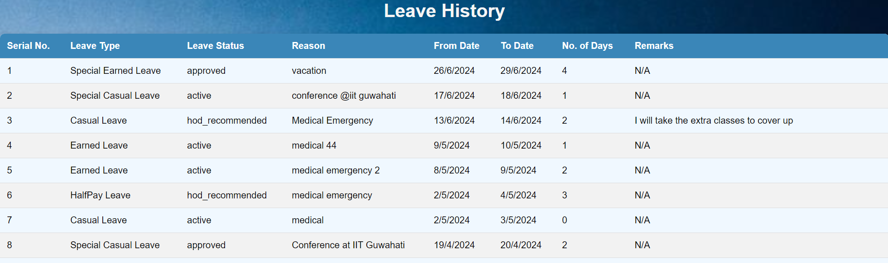
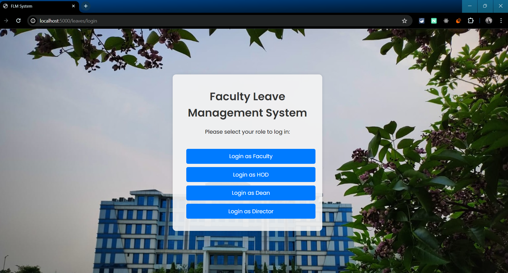
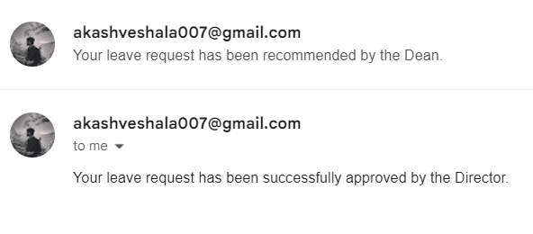

# Faculty Leave Management System

**Faculty Leave Management System** is a user-friendly digital solution designed to streamline the leave application process for college lecturers. This system allows lecturers to submit leave requests online, enabling supervisors to easily review and approve them. It enhances communication between lecturers and the college administration, ensuring efficient and transparent leave management.

## Key Features

- **Online Leave Submission:** Lecturers can submit leave requests through a convenient online interface.
- **Supervisory Review and Approval:** Supervisors can review, recommend, and approve leave requests.
- **Leave Balance Tracking:** Lecturers can track their available leave balances.
- **Notification System:** Email notifications are sent at each stage of the leave approval process.
- **Document Upload:** Faculty can upload necessary documents with their leave requests.

## Tech Stack

### Frontend
- HTML
- CSS
- JavaScript
- EJS (Embedded JavaScript Templates)

### Backend
- Node.js
- Express.js
- MongoDB

## The Process

1. **Leave Application Submission:** Lecturers submit their leave requests online.
2. **Faculty Registration:** New faculty members can register and create an account.
3. **Faculty Login:** Faculty can log in to their accounts.
4. **Leave Status Check in History:** Faculty can check the status of their leave applications in their history.
5. **HOD Recommendation:** Heads of Departments can recommend leave requests.
6. **Dean Recommendation:** Deans can review and recommend leave requests.
7. **Director Approval for Finalization:** The Director can approve or reject leave requests for finalization.
8. **Flexibility for Rejection at any stage:** Leave requests can be rejected at any stage of the approval process.
9. **Email Notification System:** Automated email notifications keep all parties informed at each stage.
10. **Available Leave Adjustments:** Leave balances are adjusted automatically after approval or rejection.

## Screenshots

### Admin Mail


### Faculty Home


### Dean Page


### Director Page


### Leave History


### Add Leave


### Faculty Login


### Main Login


### Leave Mail


## Getting Started

To set up the **Faculty Leave Management System**, follow these steps:

1. **Clone or Download:** Clone this repository to your local machine or download the project's source code.

2. **Install Dependencies:** Open a command prompt within the project folder and run the command:
    ```sh
    npm install
    ```

3. **Start the Server:** Run the following command to start the server:
    ```sh
    npm start
    ```

## Import User Data

To populate the **Faculty Leave Management System** with user data, you can use the following command to import user information into the local MongoDB server:

```sh
mongoimport --db leave-mgmt-system --collection users --file users.json
